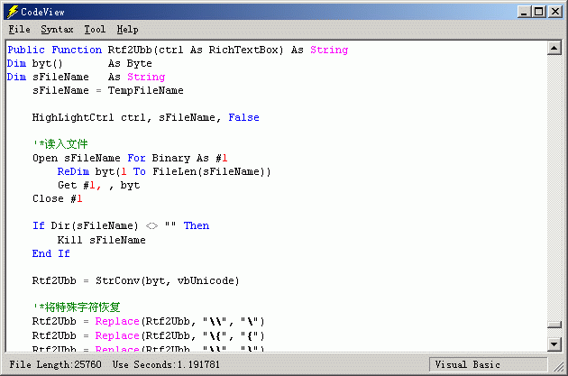

## CodeView \( syntax highlight , support many language , you can add and edit the syntax file\)

### Description

It is a class of syntax hightlight, very easy to use,but not support edit the syntax file you can add and edit file format like EDITPLUS's .stx file you can download new syntax file form it's web and edit it.(http://www.editplus.com/) i have finished it september,but it's comment is written in chinese. so i didn't submit it. my english is poor :( maybe this code can help you!

example:

Syntax.ReadFile App.Path & "\stx\vb.stx"

Syntax.HighLightRichEdit RTXT

OK,everything is changed! enjoy it!

and .....

happy new year!!!
 
### More Info
 

             |
---                |---
**Submitted On**   |2003-01-03 08:42:04
**By**             |[progame](https://github.com/Planet-Source-Code/PSCIndex/blob/master/ByAuthor/progame.md)
**Level**          |Advanced
**User Rating**    |5.0 (104 globes from 21 users)
**Compatibility**  |VB 5\.0, VB 6\.0
**Category**       |[Coding Standards](https://github.com/Planet-Source-Code/PSCIndex/blob/master/ByCategory/coding-standards__1-43.md)
**World**          |[Visual Basic](https://github.com/Planet-Source-Code/PSCIndex/blob/master/ByWorld/visual-basic.md)
**Archive File**   |[CodeView\_\(152363142003\.zip](https://github.com/Planet-Source-Code/progame-codeview-syntax-highlight-support-many-language-you-can-add-and-edit-the-syntax-fi__1-42159/archive/master.zip)

